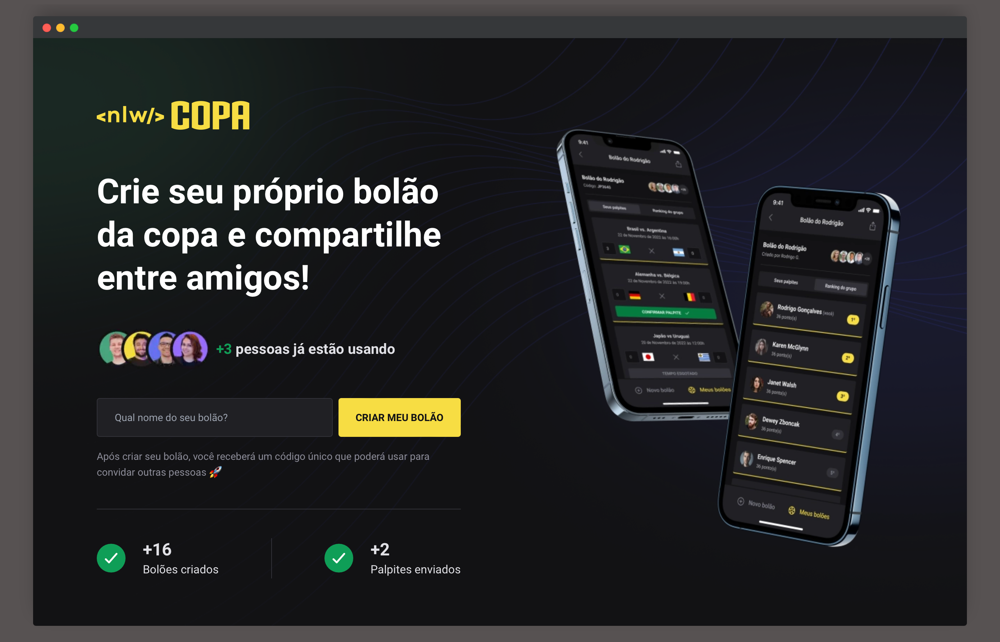

<div id='top'>

# NLW Bolão da Copa - Trilha Ignite | Rocketseat

</div>

<p align="center">
  <a href="#memo-about">About</a> &#xa0; | &#xa0; 
  <a href="#sparkles-features">Features</a> &#xa0; | &#xa0;
  <a href="#white_check_mark-requirements">Requirements</a> &#xa0; | &#xa0;
  <a href="#checkered_flag-starting">Starting</a> &#xa0; | &#xa0;
  <a href="#bookmark-api-reference">API Reference</a> &#xa0; | &#xa0;
  <a href="#memo-license">License</a> &#xa0; | &#xa0;
  <a href="https://github.com/itzmatheus" target="_blank">Author</a>
</p>


## :memo: About

During the event **NLW Bolão da Copa** we have developed a _web_ and _mobile_ platform where everyone can create a poll, share with other users, their can join and make guesses about the games of world cup 2022. This project is part of the Ignite Trail and we learned about NodeJS with Fastify, React with TypeScript and React Native with Expo.

The web application allows us to create a poll and return a code to share with friends to thei can join using the mobile application. In the mobile application, we can SignIn/SignUp and have access to the application, can create polls, join in a especific poll using the code of that poll, view a list of games from that poll, also can make a guess for the games and see the ranking witch show us who guesses mores polls of the World Cup 2022.

VAI BRAZIL! THE HEXA IS OURSSSS!!!!!

This project was developed during the event **#NLWtogether** hosted by [Rocketseat](https://www.rocketseat.com.br) with the help of the instructors [Diego Fernandes](https://github.com/diego3g) and [Rodrigo Gonçalves](https://github.com/rodrigorgtic).

<!-- prettier-ignore -->
| 🪧 Informations   |     |
| --------------- | --- |
| ✨ Name         | **API NLW Bolão da Copa** - Rocketseat |
| 🏷️ Technologies  | TypeScript, NodeJS, Fastify, JWT and Prisma|
| 💻 Web version  | [Click here](https://github.com/itzmatheus/nlw-copa-pools-web) |
| 📲 Mobile version | [Click here](https://github.com/itzmatheus/nlw-copa-pools-mobile) |
| 🔥 Design       | [**Figma**](https://www.figma.com/file/Mfwn2yVONCulrbt27qEYhF/Bol%C3%A3o-da-Copa-(Community)?node-id=0%3A1) |



## 🩹 Improvements needed

The project was totally developed according to the instructions given, no aditionals. In the future, it would be interesting to add the following implementations:

-   Discord authentication, automatically filling the form field for Discord username.

## :sparkles: Features

1. Users
    * [x] Should SigIn & SignUp with google auth;
    * [x] Should permit the logged user can view his own information;
    * [x] Should count the amount users registered;
2. Polls
    * [x] Should create a poll using a name and return a code to share with friends to their can join in this poll;
        1. Logged user create a poll associated it with they own;
        2. Anonymous user create a poll without owner associated;
    * [x] Should list the polls of a logged user;
    * [x] Should count the amount of polls created;
    * [x] Should get details about a poll;
3. Guesses
    * [x] Should create guess of a game not started in the poll when user already join;
    * [x] Should count the amount guesses created;
4. Games
    * [x] Should list the games of worl cup and the guesses of that game;

### ERD Diagram

###### _/prisma/ERD.svg_


## :white_check_mark: Requirements

Before starting 🏁, you need to have [Git](https://git-scm.com) and [Node](https://nodejs.org/en/) v18.12.0 installed.

Suggest: https://github.com/nvm-sh/nvm

## :checkered_flag: Starting

PS: if you have [make](https://www.cs.swarthmore.edu/~newhall/unixhelp/howto_makefiles.html) installed, consult Makefile to see all commands shortcuts =)

```bash
# Clone this project
$ git clone https://github.com/itzmatheus/nlw-copa-pools-api
# Access
$ cd nlw-copa-pools-api
# Install dependencies
$ npm install
# Create sqlite db local
$ npx prisma init --datasource-provider SQLite
# Run migrations
$ npx prisma migrate dev
# Run the project
$ npm run dev
# The server will initialize in the <http://localhost:3333>
```

## :bookmark: API Reference

- Consult the file: [NLW-COPA-API.postman_collection.json](NLW-COPA-API.postman_collection.json) and import the requests.

- This API uses [OAUTH2](https://oauth.net/2/). The *_access_token_* used in request to SignIn/SignUp is based on [this doc](https://docs.expo.dev/guides/authentication/#google), so you have to pass google token.

---

## :memo: License

This project is under license from MIT. For more details, see the [LICENSE](LICENSE) file.


<a href='#top'>🔼 Back to top</a>

---
Developer by [@Matheus Leite](https://itzmatheus.github.io/portfolio/)
